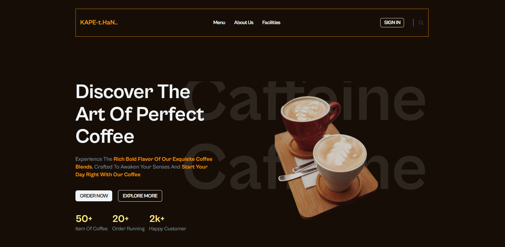
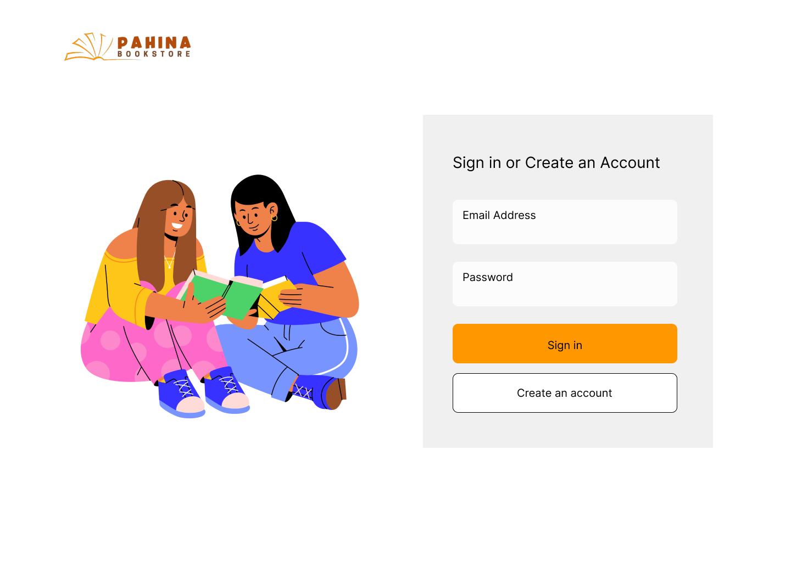
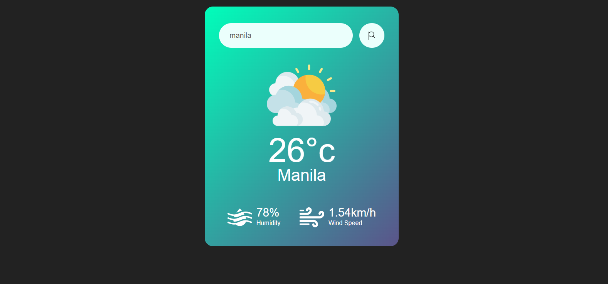
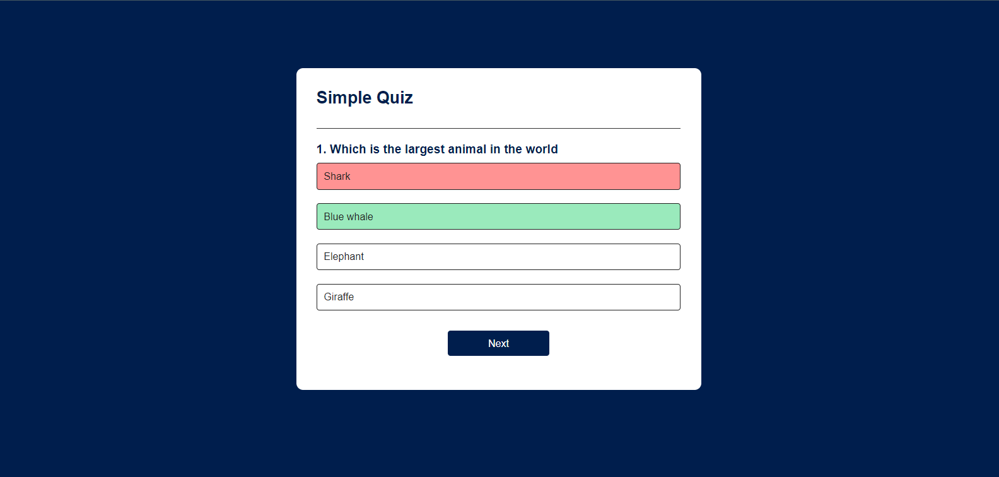
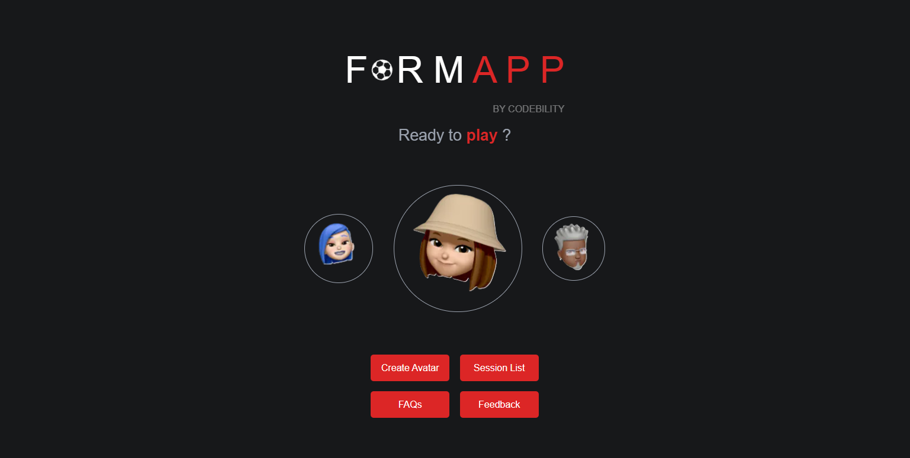
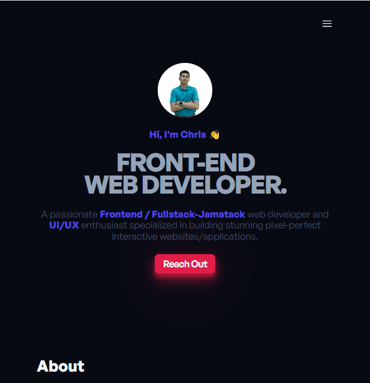

 

# 
Hi there, I'm Chris

A passionate Frontend web developer and some Backend knowledge , also a UI/UX enthusiast specialized in building stunning pixel-perfect interactive websites/applications.

   

       
       
      
   

---

### 🧰 Languages and Tools

 
     
     
     
     
     
     
      
     
     
     
     
     
     
     
     
     
     
     
     
     
     
     
     
     

 

#

### 📺 Feature Projects 

 

#

### 📊 Stats

#

 
<h3>👨‍💻 Chris Coding Journey</h3>

   Continuing on this journey, my enthusiasm for programming only deepened as I delved into the intricacies of code, Unix and Linux systems, and the theoretical foundations of computer science. Alongside my academic pursuits, I took the initiative to teach myself mobile development, fueled by a steadfast dream to one day bring my own app to life. This self-directed learning not only broadened my skill set but also served as the catalyst for the exciting opportunities that awaited me after graduation.
   Landing my first job as a software engineer marked a significant milestone in my professional journey. It was the culmination of years of dedication, self-learning, and a passion for the vast and dynamic world of computer science. Joining the workforce allowed me to apply my theoretical knowledge and programming skills in a real-world setting. The experience not only provided valuable hands-on exposure to the intricacies of software development but also opened doors to a collaborative and innovative work environment.
   Now embarking on my journey as a frontend developer has been a natural progression, building upon the solid foundation I established as a software engineer. As I transition into this specialized role, my focus has shifted towards crafting seamless and engaging user experiences. Dive into the realm of frontend development has not only refined my coding skills but has also deepened my understanding of user interface design, web accessibility, and performance optimization.

[website]: https://web-portfolio-six-beta.vercel.app/
