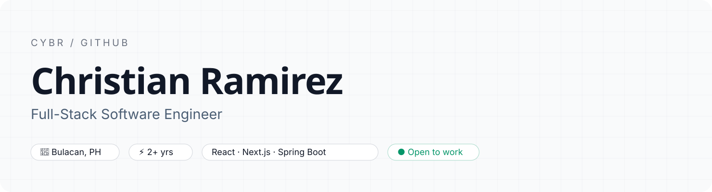
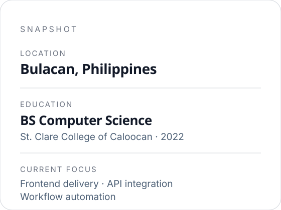
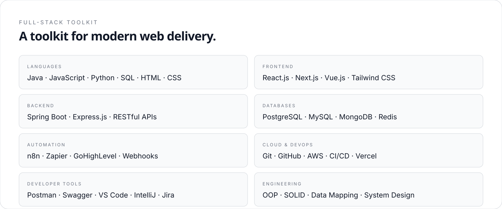
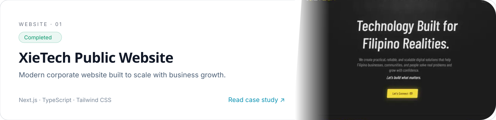
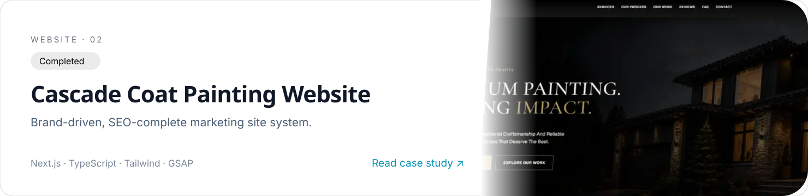
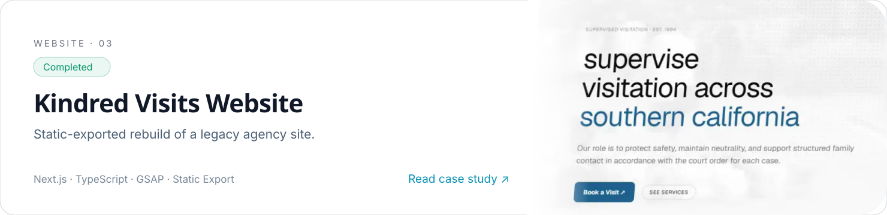
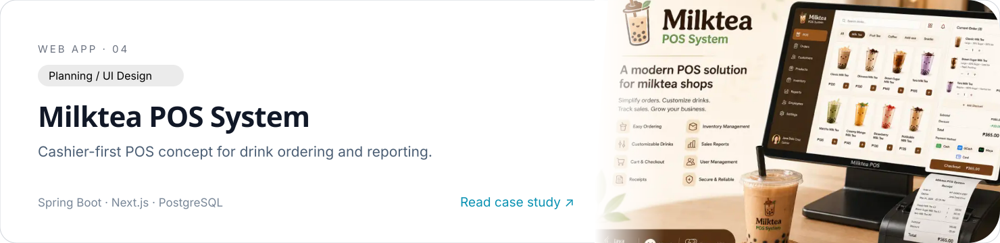
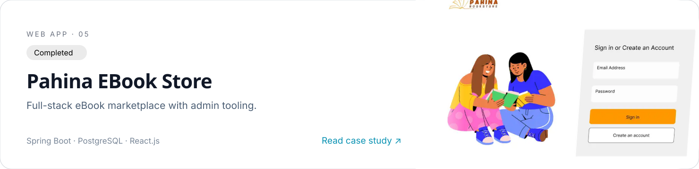
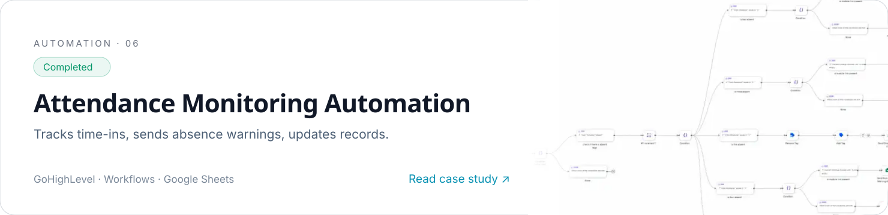
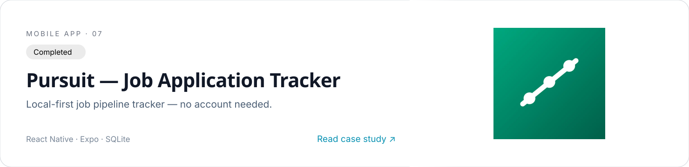

<picture>
  <source media="(prefers-color-scheme: dark)" srcset="./assets/svg/banner-dark.svg">
  
</picture>

## About

<table>
  <tr>
    <td width="62%" valign="top">

Performance-driven software engineer with 2+ years of experience across frontend development, workflow automation, API integration, and backend systems.

**Current Focus**

- Frontend delivery with Vue.js, React.js, Next.js, and Tailwind CSS
- Backend & automation across APIs, webhooks, CI/CD, and cloud logs
- Building production features end to end

</td>
    <td width="38%" valign="top">
<picture>
  <source media="(prefers-color-scheme: dark)" srcset="./assets/svg/snapshot-dark.svg">
  
</picture>
    </td>
  </tr>
</table>

## Skills

<picture>
  <source media="(prefers-color-scheme: dark)" srcset="./assets/svg/skills-matrix-dark.svg">
  
</picture>

## Featured Projects

Case studies from my portfolio — click any card to read the full breakdown.

<a href="https://christian-portfolio-one-phi.vercel.app/projects/xietech-public-website">
  <picture>
    <source media="(prefers-color-scheme: dark)" srcset="./assets/svg/proj-xietech-dark.svg">
    
  </picture>
</a>

<a href="https://christian-portfolio-one-phi.vercel.app/projects/cascade-coat-painting-website">
  <picture>
    <source media="(prefers-color-scheme: dark)" srcset="./assets/svg/proj-cascade-dark.svg">
    
  </picture>
</a>

<a href="https://christian-portfolio-one-phi.vercel.app/projects/kindred-visits-website">
  <picture>
    <source media="(prefers-color-scheme: dark)" srcset="./assets/svg/proj-kindred-dark.svg">
    
  </picture>
</a>

<a href="https://christian-portfolio-one-phi.vercel.app/projects/milktea-pos-system">
  <picture>
    <source media="(prefers-color-scheme: dark)" srcset="./assets/svg/proj-milktea-dark.svg">
    
  </picture>
</a>

<a href="https://christian-portfolio-one-phi.vercel.app/projects/pahina-ebook-store">
  <picture>
    <source media="(prefers-color-scheme: dark)" srcset="./assets/svg/proj-pahina-dark.svg">
    
  </picture>
</a>

<a href="https://christian-portfolio-one-phi.vercel.app/projects/attendance-monitoring-automation">
  <picture>
    <source media="(prefers-color-scheme: dark)" srcset="./assets/svg/proj-attendance-dark.svg">
    
  </picture>
</a>

<a href="https://christian-portfolio-one-phi.vercel.app/projects/pursuit-job-application-tracker">
  <picture>
    <source media="(prefers-color-scheme: dark)" srcset="./assets/svg/proj-pursuit-dark.svg">
    
  </picture>
</a>

## Stats

  
  
  

  

### Languages

  
  
  
  

## Experience

**Speedy Global** — Frontend Web Developer · May 2024 – Nov 2024
Built responsive Vue.js/Tailwind pages from Figma designs; integrated APIs for data capture and retrieval.

**Novare Technologies Inc.** — Associate Software Engineer · Nov 2022 – Nov 2023
Data mappings for API payloads, AWS CloudWatch monitoring, Jenkins CI/CD support, unit testing.

  
  
  

